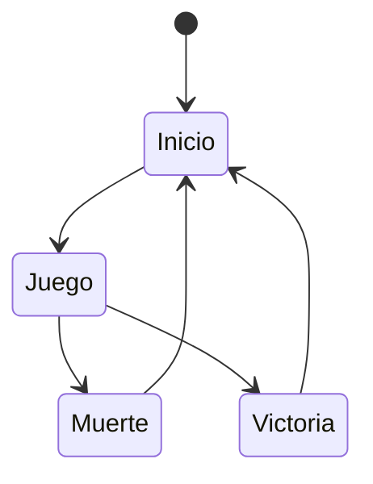
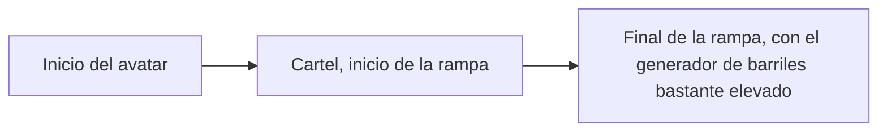
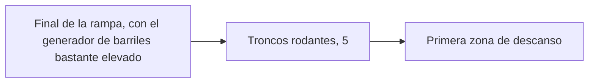
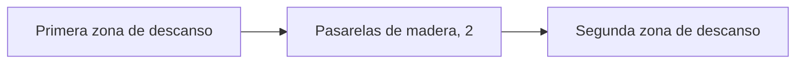
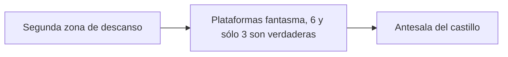
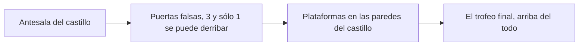
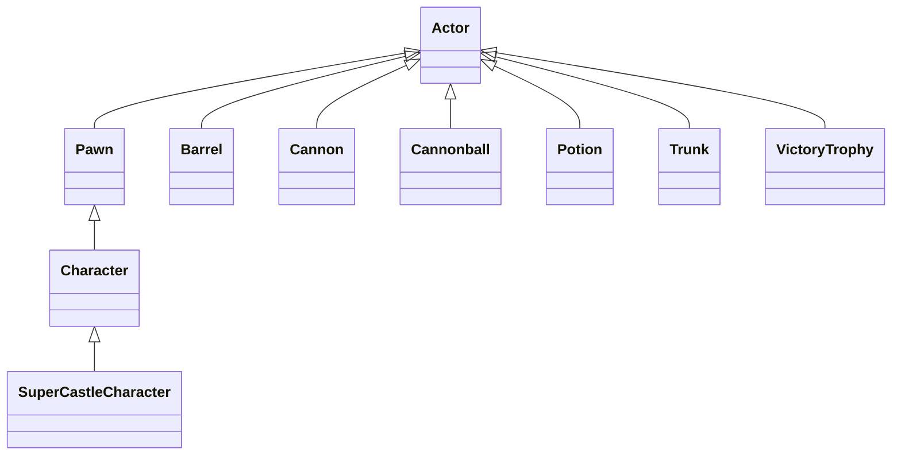

# Desarrollo de Videojuegos - Práctica 0: SuperCastle

Se trata de un prototipo básico de videojuego de plataformas 3D en el que controlamos a un personaje que debe alcanzar un trofeo en lo alto de un castillo, teniendo que superar para ello varias pruebas.

La versión original del juego fue creada por Alejandro Villar, que posteriormente fue revisada y completada por Federico Peinado. El código se distribuye bajo la licencia GPL.

El propósito es servir como ejemplo a los alumnos para las demás prácticas de la asignatura.

## Instalación y uso
Todo el contenido del proyecto está disponible aquí en el repositorio, salvo la subcarpeta StarterContent que ofrece Unreal Engine por defecto.
Esta subcarpeta debe incluirse en la carpeta Content. Si se tiene permiso, es posible [descargarla aquí](https://drive.google.com/file/d/1ece2mzryUjjU-GKg8I7tDDl_OTGqkTdx/view?usp=sharing).

Al no estar publicada todavía ninguna versión ejecutable del prototipo, ni enlazado ningún video con las pruebas realizadas, es necesario abrir el proyecto en Unreal Engine y jugarlo desde allí.

## Preproducción
Aunque no hay un enunciado como tal que sirva de punto de partida, la preproducción consistió en el diseño de un juego que plantee pruebas divertidas y un super-castillo final al que hay que escalar para conseguir el trofeo.

El diseño tiene estas secciones:
- [Estética](#Estética)
  * [Gráficos](#Gráficos)
  * [Sonidos](#Sonidos)
- [Dinámica](#Dinámica)
  * [Objetivo](#Objetivo)
  * [Castigo](#Derrota)
- [Mecánica](#Mecánica)
  * [Avatar](#Avatar)
  * [Pociones](#Pociones)
  * [Barriles](#Barriles)
  * [Troncos](#Troncos)
  * [Balas](#Balas)
  * [Plataformas fantasma](#Plataformas)
  * [Puertas falsas](#Puertas)
  * [Trofeo](#Trofeo)
- [Contenido](#Contenido)
  * [Zona 1](#Zona-1)
  * [Zona 2](#Zona-2)
  * [Zona 3](#Zona-3)
  * [Zona 4](#Zona-4)
  * [Zona 5](#Zona-5)

### Estética
El juego usa solamente el contenido de la plantilla Third Person y el de principiantes, simplificando al máximo la composición de la escena, aunque sin tener un aspecto pulido y acabado.

#### Gráficos
El juego usa solamente el contenido de la plantilla Third Person y el de principiantes.

#### Sonidos
No hay música ambiente y los sonidos utilizados son simplemente:
- **Power Up**. Se activa al coger alguna de las pociones.
- **Cañón**. Cada vez que un cañón dispara emitirá este sonido.
- **Victoria**. Cuando el jugador coge el trofeo sonará una fanfarria de victoria.

### Dinámica
La dinámica del juego consiste en llegar hasta el final sin tardar ni morir demasiado, aunque no hay límites temporales y la muerte únicamente supone repetir el recorrido desde el principio.

#### Objetivo
El objetivo del juego es pasar por todas las pruebas hasta conseguir el trofeso que se encuentra en lo más alto del castillo.

#### Castigo
El jugador solo puede morir en el caso de ser golpeado por barriles o balas de cañon. Cuando esto pase, volverá al
inicio del nivel. En el caso de caer al foso, se le ha proporcionado unas rampas para volver al principio de la prueba
en la que se ha caido, con lo que es un castigo mucho más leve.

### Contenido
A continuación detallamos el contenido más importante del juego.

#### Avatar
El clásico maniquí de Unreal Engine que se puede mover y saltar es el avatar que controla el jugador.

#### Pociones
Hay dos tipos y solo podremos coger una de cada. Lo bueno es que el efecto que tienen sobre el jugador no desaparece en toda la partida.

- **Poción de velocidad**. Es de color amarillo y permite que el avatar duplique su velocidad al cogerla. 
- **Pocion de salto**. Es de color amarillo y permite que el avatar multiplique por 1.5 su impulso al saltar.

#### Barriles

Los barriles son cilindros de varios tamaños que caen por la rampa que pertenecen a la Zona 1 y se generan de forma aleatoria en lo alto de la rampa. Si el avatar es golpeado por un barril, este se destruye pero el avatar se queda como un muñeco de trapo y se recarga el nivel desde el principio. 

#### Troncos

Los troncos son cilindros alargados de madera que giran constantemente usando una velocidad aleatoria en los ejes Y y Z.
Si el avatar se queda quieto encima de un tronco, este lo empujará con su rotación y lo tirará al foso.

#### Balas

Los cañones se encuentran en la Zona 3. La funcionalidad de los cañones es disparar balas en un intervalo aleatorio. Si una bala colisiona con el jugador, tendrá el mismo comportamiento que los barriles, es decir, la bala se destruye pero el avatar se queda como un muñeco de trapo y se recarga el nivel desde el principio. 

#### Plataformas fantasma

Podemos encontrar plataformas normales en las Zonas 4 y 5. Sin embargo, en el primero de ellos algunas de las plataformas no tienen colisión (se podría decir que son ``fantasma'') y dejan caer al jugador.

#### Puertas falsas

Para entrar en el castillo nos encontramos con 3 puertas. Sólo una de ellas es posible derribarla.

#### Trofeo

Se trata de una esfera dorada que sirve de recompensa final. Al cogerla, termina el juego.

### Contenido
Estos son los diagramas topológicos de las distintas zonas del nivel. Sería interesante añadir alguna captura de dibujos o esquemas sobre el nivel y sus contenidos.

#### Zona-1

El juego comienza con una rampa que hay que subir, esquivando barriles.

#### Zona-2

Después hay que superar unos roncos rodantes. Aunque no los superes y caigas, es posible ir directamente a la primera zona de descanso.

#### Zona-3

La tercera zona consiste en cruzar unas pasarelas de madera, esquivando balas de cañón.

#### Zona-4

La cuarta zona consiste en saltar sobre plataformas fantasma. Algunas son falsas y no son sólidas, no puedes apoyarte en ellas.

#### Zona-5

La última zona es la del castillo. Primero hay que cruzar las puertas (afortunadamente una es falsa y se puede derribar) y después subir plataformas hasta llegar arriba del todo, donde está el trofeo del juego.

## Producción

Las tareas se han realizado y el esfuerzo ha sido repartido entre los autores.

| Estado  |  Tarea  |  Fecha  |  
|:-:|:--|:-:|
| ✔ | Diseño: Primer borrador | 2-12-2021 |
| ✔ | Mecánica: Barriles que matan | 11-12-2021 |
| ✔ | Mecánica: Balas de cañon que matan | 11-12-2021 |
| ✔ | Mecánica: Poción de velocidad | 12-12-2021 |
| ✔ | Mecánica: Poción de salto | 12-12-2021 |
|   | ... | |
|  | OPCIONAL |  |
| ✔ | Generador barriles | 3-12-2021 |
| :x: | Menú | 3-12-2021 |
| :x: | HUD | 12-12-2021 |

Como lista de mecánicas implementadas podría expresarse así:
- [x] Mecánica: Barriles que matan
- [x] Mecánica: Balas de cañon que matan 
- [x] Mecánica: Poción de velocidad
- [x] Mecánica: Poción de salto 
- [ ] ...

Las clases principales que se han desarrollados son las siguientes.

## Posproducción

Queda toda la posproducción por hacer: el pulido y la distribución del ejecutable del juego.

## Licencia

A, B y C, autores de la documentación, código y recursos de este trabajo, concedemos permiso permanente a los profesores de la Facultad de Informática de la Universidad Complutense de Madrid para utilizar nuestro material, con sus comentarios y evaluaciones, con fines educativos o de investigación; ya sea para obtener datos agregados de forma anónima como para utilizarlo total o parcialmente reconociendo expresamente nuestra autoría.

Una vez superada con éxito la asignatura se prevee publicar todo en abierto (la documentación con licencia Creative Commons Attribution 4.0 International (CC BY 4.0) y el código con licencia GNU Lesser General Public License 3.0).

## Referencias
Fall Guys, de Mediatonic Games.

